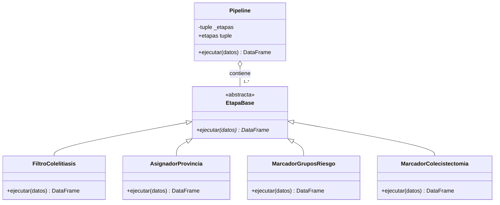

# Arquitectura del núcleo de F3

## Diagrama de clases

```mermaid
classDiagram
    direction TB

    class EtapaBase {
        <<abstracta>>
        +ejecutar(datos) DataFrame*
    }

    class Pipeline {
        -tuple _etapas
        +etapas tuple
        +ejecutar(datos) DataFrame
    }

    class FiltroColelitiasis {
        +ejecutar(datos) DataFrame
    }

    class AsignadorProvincia {
        +ejecutar(datos) DataFrame
    }

    class MarcadorGruposRiesgo {
        +ejecutar(datos) DataFrame
    }

    class MarcadorColecistectomia {
        +ejecutar(datos) DataFrame
    }

    EtapaBase <|-- FiltroColelitiasis
    EtapaBase <|-- AsignadorProvincia
    EtapaBase <|-- MarcadorGruposRiesgo
    EtapaBase <|-- MarcadorColecistectomia
    Pipeline o-- "1..*" EtapaBase : contiene
```